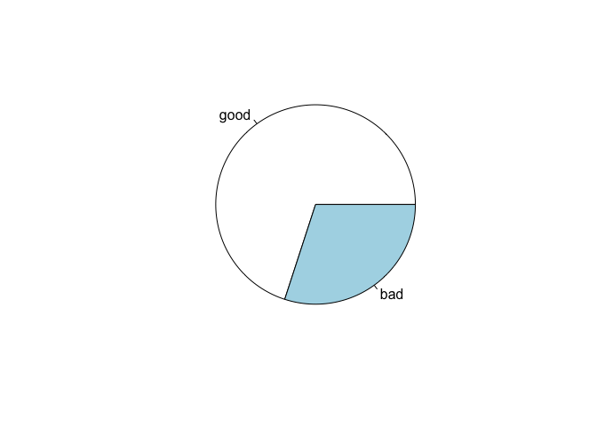

Building a Classification Model for Credit Scoring using ML Techniques- Techniques Used: GLM, Trees, GAM,LDA and SVM
================

-   [References](#references)
-   [Purpose of the Case Study](#purpose-of-the-case-study)
-   [Packages Used and Data subsetting](#packages-used-and-data-subsetting)
-   [Exploratory Data Analysis](#exploratory-data-analysis)
-   [Logistic Regression](#logistic-regression)
-   [Trees](#trees)
-   [General Additive Model](#general-additive-model)
-   [Linear Discriminant Analysis](#linear-discriminant-analysis)
-   [Support Vector Machines](#support-vector-machines)

References
----------

1.  [Introduction to statistical learning](http://www-bcf.usc.edu/~gareth/ISL/)
2.  [Elements of statistical learning](https://statweb.stanford.edu/~tibs/ElemStatLearn/)
3.  [R Bloggers](https://www.r-bloggers.com/)

Purpose of the Case Study
-------------------------

German Credit dataset contains information about the default/non-default predictors across several industries.

We fit supervised and classification models to the dataset consisting of 1000 observations and 21 variables.

The dataset contains 20 predictor variables i.e. Status of checking account, credit history, purpose, savings accounts/bonds, present employment since, personal status and sex, other debtors/guarantors, property, other installment plans, housing, job, telephone, foreign worker, duration in month, credit amount, installment rate in terms of percentage of disposable income, present resident since, age in years, number of existing credits, number of people liable to provide maintenance and 1 response variable: default or no default status.

The dataset is randomly sampled into 75% training and 25% testing data. A comparison based on different models based on different flexibilities, misclassification rates, area under the curve and mean residual deviance are made. We choose an asymmetric cost of 5:1 which is False Negative: False Positive.

Packages Used and Data subsetting
---------------------------------

The below packages are used for loading data, visualizations, model building and for creating creative plots of the results from each model.

``` r
library(ggplot2) 
library(car)
library(verification)
library(ROCR)
library(rpart)
library(rattle)
library(mgcv)
library(e1071)
library(reshape)
```

We set up the data using a random seed to sample the data into 75% training and 25% training data. We dont have sufficient data points to have a validation data as well.

``` r
german_credit = 
  read.table("http://archive.ics.uci.edu/ml/machine-learning-databases/statlog/german/german.data")

colnames(german_credit) = c("chk_acct", "duration", "credit_his", 
                            "purpose", "amount", "saving_acct", 
                            "present_emp",   "installment_rate", 
                            "sex", "other_debtor", "present_resid", 
                            "property", "age", "other_install", 
                            "housing", "n_credits",  "job", 
                            "n_people", "telephone", "foreign", "response")

german_credit$response = german_credit$response - 1
set.seed(10857825)
subset <- sample(nrow(german_credit), nrow(german_credit) * 0.75)
credit.train = german_credit[subset, ]
credit.test = german_credit[-subset, ]
```

Exploratory Data Analysis
-------------------------

Density Plots:

We use simple density plots to understand the difference of the distribution of data across the response of 0 and 1 across different numeric variable which shows an indication of predictive power.

``` r
german_credit$response <- factor(german_credit$response)

ggplot(data = melt(german_credit), aes(x = value, color= response)) +
  geom_density(fill="white",alpha=0.55) +
  facet_wrap(~variable, scales = "free")
```


Distribution of Data:

A simple pie chart shows that most of the data is concentrated around good loans or non-defaulters with 0 as response (700 data points nearly).

``` r
pie(table(german_credit$response),c("good","bad"))
```



Correlation Matrix:

A simple correlation matrix in Figure 9 between the different numeric predictors is as shown below, we don’t observe major correlation except between duration and amount.

``` r
#Correlation Plots
c <- cor(german_credit[sapply(german_credit, is.numeric)], use="complete.obs", method="pearson")
c
```

    ##                     duration      amount installment_rate present_resid
    ## duration          1.00000000  0.62498420       0.07474882    0.03406720
    ## amount            0.62498420  1.00000000      -0.27131570    0.02892632
    ## installment_rate  0.07474882 -0.27131570       1.00000000    0.04930237
    ## present_resid     0.03406720  0.02892632       0.04930237    1.00000000
    ## age              -0.03613637  0.03271642       0.05826568    0.26641918
    ## n_credits        -0.01128360  0.02079455       0.02166874    0.08962523
    ## n_people         -0.02383448  0.01714215      -0.07120694    0.04264343
    ##                          age   n_credits    n_people
    ## duration         -0.03613637 -0.01128360 -0.02383448
    ## amount            0.03271642  0.02079455  0.01714215
    ## installment_rate  0.05826568  0.02166874 -0.07120694
    ## present_resid     0.26641918  0.08962523  0.04264343
    ## age               1.00000000  0.14925358  0.11820083
    ## n_credits         0.14925358  1.00000000  0.10966670
    ## n_people          0.11820083  0.10966670  1.00000000

Logistic Regression
-------------------

We fit generalized linear model in this case, it is logistic regression for classification using a linear relationship between the predictors and the response.

We find that log-log link provides the best fit in terms of lowest AIC/BIC. We then fit using logit link on the GLM model and do model selection using stepwise with AIC and BIC and use the AIC model as it produces lesser deviance in the model.

``` r
#Logit function
creditmod <-glm(response~., family = binomial, credit.train)
AIC(creditmod)
```

    ## [1] 763.479

``` r
BIC(creditmod)
```

    ## [1] 989.8626

``` r
#Probit Function
probitmod <- glm(response~., family = binomial(link="probit"), data=credit.train)
AIC(probitmod)
```

    ## [1] 763.7495

``` r
BIC(probitmod)
```

    ## [1] 990.1331

``` r
#Log Log Function
loglogmod<-glm(response~., family = binomial(link="cloglog"), data=credit.train)
AIC(loglogmod)
```

    ## [1] 760.0527

``` r
BIC(loglogmod)
```

    ## [1] 986.4363

``` r
#Model Selection-AIC
creditmod.step <- step(creditmod, trace=FALSE)
hist(predict(creditmod.step, type = "response"))
```


``` r
deviance(creditmod.step)
```

    ## [1] 686.3266

``` r
#Model Selection-BIC
creditmod.BIC <- step(creditmod, k = log(nrow(credit.train)),trace=FALSE)
hist(predict(creditmod.BIC, type = "response"))
```


``` r
deviance(creditmod.BIC)
```

    ## [1] 759.3835

In Sample : AUC: 0.83 Misclassification Rate: 0.37 Cost:0.50

``` r
creditcost <- function(observed, predicted) {
    weight1 = 5
    weight0 = 1
    c1 = (observed == 1) & (predicted == 0)  #logical vector - true if actual 1 but predict 0
    c0 = (observed == 0) & (predicted == 1)  #logical vecotr - true if actual 0 but predict 1
    return(mean(weight1 * c1 + weight0 * c0))
}
#insample
prob.glm1.insample <- predict(creditmod.step, type = "response")
predicted.glm1.insample <- prob.glm1.insample > 0.1666
predicted.glm1.insample <- as.numeric(predicted.glm1.insample)
#Confusion Matrix
(table(credit.train$response, predicted.glm1.insample, dnn = c("Truth", "Predicted")))
```

    ##      Predicted
    ## Truth   0   1
    ##     0 264 257
    ##     1  23 206

``` r
#Error Rate
mean(ifelse(credit.train$response != predicted.glm1.insample, 1, 0))
```

    ## [1] 0.3733333

``` r
roc.plot(credit.train$response == "1", prob.glm1.insample)
roc.plot(credit.train$response == "1", prob.glm1.insample)$roc.vol
```


    ##      Model      Area     p.value binorm.area
    ## 1 Model  1 0.8251976 4.66506e-46          NA

``` r
creditcost(credit.train$response, predicted.glm1.insample)
```

    ## [1] 0.496

Out of Sample : AUC: 0.76 Misclassification Rate: 0.38 Cost: 0.56

``` r
#outsample
prob.glm1.outsample <- predict(creditmod.step, credit.test, type = "response")
predicted.glm1.outsample <- prob.glm1.outsample > 0.1666
predicted.glm1.outsample <- as.numeric(predicted.glm1.outsample)

#Confusion Matrix
table(credit.test$response, predicted.glm1.outsample, dnn = c("Truth", "Predicted"))
```

    ##      Predicted
    ## Truth  0  1
    ##     0 94 85
    ##     1 11 60

``` r
mean(ifelse(credit.test$response != predicted.glm1.outsample, 1, 0))
```

    ## [1] 0.384

``` r
pred <- prediction(prob.glm1.outsample, credit.test$response)
perf <- performance(pred, "tpr", "fpr")
plot(perf, colorize = TRUE)
abline(a=0, b= 1)
```


``` r
auc.perf = performance(pred, measure = "auc")
auc.perf@y.values
```

    ## [[1]]
    ## [1] 0.7588323

``` r
creditcost(credit.test$response, predicted.glm1.outsample)
```

    ## [1] 0.56

We find that the misclassification rate and costs are quite comparable proving a good underlying fit which indicates a linear relationship between the predictors and the response. We can compare this to other flexible and relatively inflexible models to understand the fit.

We perform cross-validation to find the optimal cut-off probability to choose and get 0.17, which is close to the original asymmetric cost chosen (5:1, therefore 1/6). The misclassification rate reduces to 0.37 in test data.

``` r
#Cross- Validation
searchgrid = seq(0.01, 0.6, 0.02)
result = cbind(searchgrid, NA)
cost1 <- function(r, pi) {
  weight1 = 5
  weight0 = 1
  c1 = (r == 1) & (pi < pcut)  #logical vector - true if actual 1 but predict 0
  c0 = (r == 0) & (pi > pcut)  #logical vecotr - true if actual 0 but predict 1
  return(mean(weight1 * c1 + weight0 * c0))
}
credit.glm1 <- glm(response ~ chk_acct + duration + credit_his + purpose + amount + saving_acct + present_emp + installment_rate +other_debtor +  age + other_install + housing + foreign, family = binomial, german_credit)
for (i in 1:length(searchgrid)) {
  pcut <- result[i, 1]
  result[i, 2] <- cv.glm(data = german_credit, glmfit = credit.glm1, cost = cost1, 
                         K = 3)$delta[2]
}
plot(result, ylab = "CV Cost")
```


``` r
result[which.min((result[,2])),]
```

    ## searchgrid            
    ##    0.17000    0.49268

``` r
#ROC for cross validation
prob.glm1.insample <- predict(creditmod.step, type = "response")
predicted.glm1.insample <- prob.glm1.insample > 0.17
predicted.glm1.insample <- as.numeric(predicted.glm1.insample)
#Confusion Matrix
(table(credit.train$response, predicted.glm1.insample, dnn = c("Truth", "Predicted")))
```

    ##      Predicted
    ## Truth   0   1
    ##     0 269 252
    ##     1  23 206

``` r
#Error Rate
mean(ifelse(credit.train$response != predicted.glm1.insample, 1, 0))
```

    ## [1] 0.3666667

``` r
library("verification")
roc.plot(credit.train$response == "1", prob.glm1.insample)
roc.plot(credit.train$response == "1", prob.glm1.insample)$roc.vol
```


    ##      Model      Area     p.value binorm.area
    ## 1 Model  1 0.8251976 4.66506e-46          NA

Trees
-----

We fit classification trees using Gini index as the impurity index and plotted the tree with the following misclassification table.

``` r
#Classification Trees
par(mfrow=c(1,1))
credit.rpart <- rpart(formula = response ~ . , data = credit.train, method = "class", 
                      parms = list(loss = matrix(c(0, 5, 1, 0), nrow = 2)))
fancyRpartPlot(credit.rpart)
```


In-Sample: AUC: 0.88 Misclassification Rate: 0.34 Cost: 0.35

``` r
#Prediction using Classification Tree- In Sample
credit.train.pred.tree1 = predict(credit.rpart, type = "class")
table(credit.train$response, credit.train.pred.tree1, dnn = c("Truth", "Predicted"))
```

    ##      Predicted
    ## Truth   0   1
    ##     0 271 250
    ##     1   3 226

``` r
mean(ifelse(credit.train$response != credit.train.pred.tree1, 1, 0))
```

    ## [1] 0.3373333

``` r
#ROC Curv-In Sample
credit.rpart2 <- rpart(formula = response ~ ., data = credit.train, method = "class", 
                       cp = 5e-04)
creditcost(credit.train$response, credit.train.pred.tree1)
```

    ## [1] 0.3533333

Out of Sample: AUC:0.74 Misclassification Rate: 0.58 Cost: 0.50

``` r
#Prediction using Classification Tree- Out Sample
credit.test.pred.tree1 = predict(credit.rpart, credit.test,type = "class")
table(credit.test$response, credit.test.pred.tree1, dnn = c("Truth", "Predicted"))
```

    ##      Predicted
    ## Truth   0   1
    ##     0  78 101
    ##     1   5  66

``` r
mean(ifelse(credit.train$response != credit.test.pred.tree1, 1, 0))
```

    ## [1] 0.5786667

``` r
#ROC Curve-Out Sample
credit.rpart2 <- rpart(formula = response ~ ., data = credit.train, method = "class", 
                       cp = 5e-04)
##Creditcost
creditcost(credit.test$response, credit.test.pred.tree1)
```

    ## [1] 0.504

We see that the testing data is showing more misclassifications and the training is overfitting the data and the tree might have to be pruned to get better results.

General Additive Model
----------------------

We fit generalized additive model to capture some non-linear relationships for the numeric variables in the data using splines. The degrees of freedom of each of the spline depends on the combination of the covariates within each variable.

``` r
gam_formula <- as.formula(paste("response~s(duration)+s(amount)+s(age)"))
fitGAM <- gam(formula = gam_formula, family = binomial, data = credit.train)
summary(fitGAM)
```

    ## 
    ## Family: binomial 
    ## Link function: logit 
    ## 
    ## Formula:
    ## response ~ s(duration) + s(amount) + s(age)
    ## 
    ## Parametric coefficients:
    ##             Estimate Std. Error z value Pr(>|z|)    
    ## (Intercept) -0.87347    0.08319   -10.5   <2e-16 ***
    ## ---
    ## Signif. codes:  0 '***' 0.001 '**' 0.01 '*' 0.05 '.' 0.1 ' ' 1
    ## 
    ## Approximate significance of smooth terms:
    ##               edf Ref.df Chi.sq  p-value    
    ## s(duration) 3.485  4.359 25.440 6.44e-05 ***
    ## s(amount)   2.578  3.239  4.731   0.1999    
    ## s(age)      1.871  2.352  6.898   0.0477 *  
    ## ---
    ## Signif. codes:  0 '***' 0.001 '**' 0.01 '*' 0.05 '.' 0.1 ' ' 1
    ## 
    ## R-sq.(adj) =  0.0564   Deviance explained =  5.4%
    ## UBRE = 0.18798  Scale est. = 1         n = 750

``` r
par(mfrow=c(2,2))
plot(fitGAM, shade = TRUE,seWithMean = TRUE, scale = 0)
```


In-Sample: AUC: 0.65 Misclassification Rate: 0.30 Cost: 1.43

``` r
##insample
fittedGAM.insample.prob <- predict(fitGAM)
fittedGAM.insample <- as.numeric(fittedGAM.insample.prob > 0.16)
table(credit.train$response, fittedGAM.insample, dnn = c("Observation", "Prediction"))
```

    ##            Prediction
    ## Observation   0   1
    ##           0 511  10
    ##           1 213  16

``` r
mean(ifelse(credit.train$response != fittedGAM.insample, 1, 0))
```

    ## [1] 0.2973333

``` r
roc.plot(credit.train$response == "1", fittedGAM.insample.prob)
roc.plot(credit.train$response == "1", fittedGAM.insample.prob)$roc.vol 
```


    ##      Model      Area      p.value binorm.area
    ## 1 Model  1 0.6530941 1.160424e-11          NA

``` r
creditcost(credit.train$response, fittedGAM.insample)
```

    ## [1] 1.433333

We find that the GAM fit is more linear than non-linear in fitting of the splines and fits a linear relationship for most of the variables except some variables, hence proving that a linear relationship maybe the best given the underlying data. We can also see that the cost is very much higher when compared to other linear models.

Out of Sample: AUC:0.70 Misclassification Rate: 0.28 Cost: 1.36

``` r
##out-sample
fittedGAM.outsample.prob <- predict(fitGAM, credit.test)
fittedGAM.outsample <- as.numeric(fittedGAM.outsample.prob > 0.16)
table(credit.test$response, fittedGAM.outsample, dnn = c("Observation", "Prediction"))
```

    ##            Prediction
    ## Observation   0   1
    ##           0 178   1
    ##           1  68   3

``` r
mean(ifelse(credit.test$response != fittedGAM.outsample, 1, 0))
```

    ## [1] 0.276

``` r
roc.plot(credit.test$response == "1", fittedGAM.outsample.prob)
roc.plot(credit.test$response == "1", fittedGAM.outsample.prob)$roc.vol 
```


    ##      Model      Area      p.value binorm.area
    ## 1 Model  1 0.7087104 1.347241e-07          NA

``` r
creditcost(credit.test$response, fittedGAM.outsample)
```

    ## [1] 1.364

Linear Discriminant Analysis
----------------------------

We use linear discriminant analysis as a classification technique with certain assumptions, the underlying distribution is Gaussian or normal and the output has a linear relationship with the predictors. The performance of LDA depends on these given assumptions.

``` r
fitLDA <- lda(response~ ., data = credit.train)
```

We fit LDA using the training data and find the following misclassification table.

In-Sample: AUC: 0.84 Misclassification Rate: 0.35 Cost:0.49

``` r
##insample 
lda.in <- predict(fitLDA)
pcut.lda <- 0.16
pred.lda.in <- (lda.in$posterior[, 2] >= pcut.lda) * 1
table(credit.train$response, pred.lda.in, dnn = c("Obs", "Pred"))
```

    ##    Pred
    ## Obs   0   1
    ##   0 285 236
    ##   1  26 203

``` r
mean(ifelse(credit.train$response != pred.lda.in, 1, 0))
```

    ## [1] 0.3493333

``` r
roc.plot(credit.train$response == "1", lda.in$posterior[, 2])
roc.plot(credit.train$response == "1", lda.in$posterior[, 2])$roc.vol 
```


    ##      Model      Area      p.value binorm.area
    ## 1 Model  1 0.8350502 9.186735e-49          NA

``` r
creditcost(credit.train$response, pred.lda.in)
```

    ## [1] 0.488

Out of Sample: AUC:0.78 Misclassification Rate: 0.37 Cost: 0.53

``` r
##outsample 
lda.out <- predict(fitLDA, newdata = credit.test)
cut.lda <- 0.16
pred.lda.out <- as.numeric((lda.out$posterior[, 2] >= cut.lda))
table(credit.test$response, pred.lda.out, dnn = c("Obs", "Pred"))
```

    ##    Pred
    ## Obs  0  1
    ##   0 97 82
    ##   1 10 61

``` r
mean(ifelse(credit.test$response != pred.lda.out, 1, 0)) 
```

    ## [1] 0.368

``` r
roc.plot(credit.test$response == "1", lda.out$posterior[, 2])
roc.plot(credit.test$response == "1", lda.out$posterior[, 2])$roc.vol 
```


    ##      Model      Area      p.value binorm.area
    ## 1 Model  1 0.7814147 2.019867e-12          NA

``` r
creditcost(credit.test$response, pred.lda.out)
```

    ## [1] 0.528

We find that the performance between test and training data to be comparable and hence a good indicator of the underlying relationship between the predictors and response might be linear and may follow the assumptions made by LDA.

Support Vector Machines
-----------------------

Support vector machine (SVM) is touted as one of the best off-the-shelf classifying algorithm. It handles non-linearity, well-regularized, has very few parameters(support vectors) and is very fast.

SVM algorithm works on finding a hyperplane which will maximize the distance between the hyperplane and the support vectors.

The formulation of the hyperplane can be both linear and non-linear. We use SVM on our data to fit a classifying hyperplane to divide between the binary response.

``` r
credit.svm = svm(response ~ ., data = credit.train, cost = 1, gamma = 1/length(credit.train), 
                 probability = TRUE)
```

In-Sample: AUC: 0.92 Misclassification Rate: 0.17 Cost:0.31

``` r
prob.svm = predict(credit.svm, credit.train, probability = TRUE)
pred.svm = as.numeric((prob.svm >= 0.16))
table(credit.train$response, pred.svm, dnn = c("Obs", "Pred"))
```

    ##    Pred
    ## Obs   0   1
    ##   0 416 105
    ##   1  25 204

``` r
mean(ifelse(credit.train$response != pred.svm, 1, 0))
```

    ## [1] 0.1733333

``` r
creditcost(credit.train$response, pred.svm)
```

    ## [1] 0.3066667

``` r
roc.plot(credit.train$response == "1", prob.svm)
roc.plot(credit.train$response == "1", prob.svm)$roc.vol 
```


    ##      Model      Area      p.value binorm.area
    ## 1 Model  1 0.9216321 5.535216e-76          NA

Out of Sample: AUC:0.75 Misclassification Rate: 0.33 Cost: 0.60

``` r
prob.svm = predict(credit.svm, credit.test, probability = TRUE)
pred.svm = as.numeric((prob.svm >= 0.16))
table(credit.test$response, pred.svm, dnn = c("Obs", "Pred"))
```

    ##    Pred
    ## Obs   0   1
    ##   0 113  66
    ##   1  17  54

``` r
mean(ifelse(credit.test$response != pred.svm, 1, 0))
```

    ## [1] 0.332

``` r
creditcost(credit.test$response, pred.svm)
```

    ## [1] 0.604

``` r
roc.plot(credit.test$response == "1", prob.svm)
roc.plot(credit.test$response == "1", prob.svm)$roc.vol 
```


    ##      Model     Area     p.value binorm.area
    ## 1 Model  1 0.758675 9.13275e-11          NA

We find that SVM over-fits in the training dataset leading to a marked increase in misclassification rate and costs associated.
